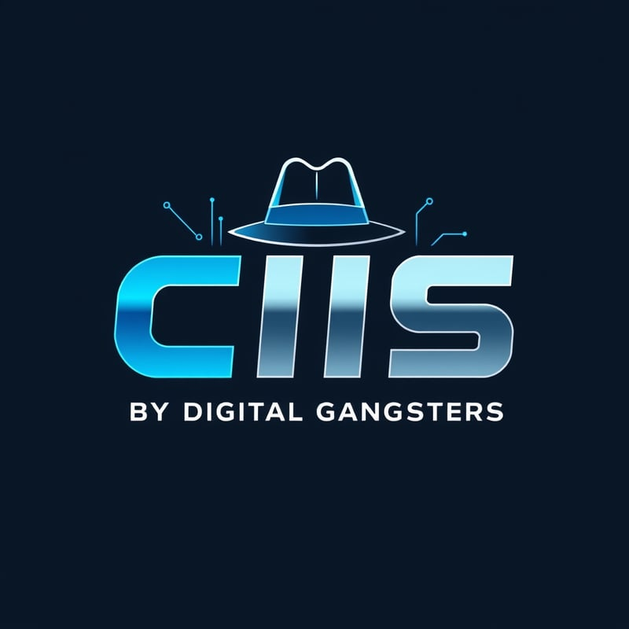

<div align="center">
  
  <h2>
      CIIS API by Digital Gangsters
  </h2>
</div>

<div align="center">
    <a href="https://github.com/yourusername/user-management-system-csharp/blob/main/LICENSE">
        
    </a>
    <a href="https://github.com/yourusername/user-management-system-csharp/releases">
        
    </a>
    <a href="https://github.com/yourusername/user-management-system-csharp/issues">
        
    </a>
    <a href="https://github.com/yourusername/user-management-system-csharp/graphs/contributors">
        
    </a>
</div>

<div align="center">
    API for managing topics, ideas, and voting. This system allows users to propose ideas under specific topics and vote on them. It integrates with the User Management API built in Java and Spring Boot.
</div>
<div align="center"><b>
<h4>See the <a href="https://gitlab.com/groups/jala-university1/cohort-3/oficial-es-desarrollo-de-software-3-cssd-232.ga.t1.25.m2/secci-n-d/digitalgangters/-/wikis/home">docs</a> for more info.</h4>
</b>
</div>

<br>
<br>

<div align="center">
<h2>
🔐 About the Project</h2>

  <p>
    This project provides an API for managing topics, ideas, and votes. Users can create topics, propose ideas, and vote on them. Authentication and user management are handled by an external Spring Boot API. This system is built using C# and .NET Core.
  </p>
</div>

<br>
<br>

<div align="center">
  <h2>🚀 Features</h2>
  <ul align="left">
    <li>🗳️ Create and manage topics for discussions.</li>
    <li>💡 Submit and track ideas under specific topics.</li>
    <li>📊 Upvote and downvote ideas to determine popularity.</li>
    <li>🔐 Integrates with an external User Management API for authentication.</li>
    <li>📑 API documentation using Swagger for easy endpoint access.</li>
  </ul>
</div>

<br>
<br>

<div align="center">
<h2>
🤝 Contributing
</h2>
</div>

We welcome contributions to the User Management System! Please fork the repository, create a feature branch, and submit a pull request with your improvements. Be sure to follow the guidelines in our [contribution documentation](/contributing.md).

<br>
<br>

<div align="center">
<h2>
License 📜
</h2>
</div>

This project is licensed under the MIT License - see the [LICENSE](/licence.md) file for details.

<br>
<br>

<div align="center">
<h2>
Technologies Used 🔧
</h2>
</div>

<div style="display: grid; grid-template-columns: repeat(auto-fill, minmax(100px, 1fr)); gap: 10px; justify-items: center;" align="center">
  
  
  
  
  
  
  
  
</div>

<br>
<br>

<div align="center">
<h2>
SetUp 💻🔌
</h2>
</div>

### 1. Clone the repository:

 ```bash
   git clone https://gitlab.com/jala-university1/cohort-3/oficial-es-desarrollo-de-software-3-cssd-232.ga.t1.25.m2/secci-n-d/digitalgangters/cis-csharp.git
 ```

###3. execute the docker compose file:

 ```bash
    docker-compose up -d
 ```

 ### 3. Open the project in Visual Studio Code:

 ```bash
    dotnet restore
 ```

 ### 4. Run the project:

 ```bash
    dotnet watch run --project /CisApi
```

### 5. Open Swagger in your browser:

```bash
http://localhost:5202/swagger/index.html
```

and enjoy!